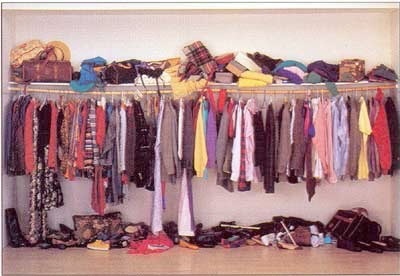
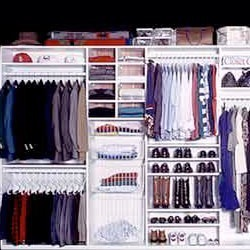

## {background-image="images/lecture-01/wave.jpg" background-size="cover"}

<!-- TODO: talking point -- discuss the photo before diving into logistics -->

## Introductions

**Us:**

- Instructor:  —  · OH: <TODO-office-hours>
- Lecture TA: <TODO>
- Course Coordinator: <TODO>

**Course staff:** <TODO>

## All you need to know is on Canvas!

::: {.columns}
::: {.column width="50%"}
Info on:

- Staff
- Communications
- Lab sections
- PAs
- Exams
- Marking
- Academic Integrity
:::

::: {.column width="50%"}
- PAs — Due Mon after 2wk
- HWs — Due Mon after 1wk
- Labs — once a week, av Sun-Sun
- Exams — 50min in CBTF
- Class Meetings — <TODO-days-and-times>
:::
:::

[<TODO-canvas-url>](<TODO-canvas-url>)

## Term Schedule

<!-- CSS: include once -->
<style>
  .pill{display:inline-block; min-width:28px; padding:2px 6px; border-radius:4px; text-align:center; font-weight:600; line-height:1;}
  .pill--off{background:#ddd; color:#111;}
  .pill--class{background:purple; color:#fff;}
  .pill--video{background:#f97316; color:#fff;}
  .pill--lab{background:dodgerblue; color:#fff;}
  .pill--exam{background:seagreen; color:#fff;}
  .pill--hw{background:#facc15; color:#111;}
  .pill--pa{background:#ef4444; color:#fff;}
  .week-num{font-size:1.9em; font-weight:800; line-height:1;}
  .date-cell{font-size:1em; white-space:nowrap; color:#666;}
  table td, table th{vertical-align:middle;}
</style>

| Week | Mon        | M                                                        | W                                                        | F                                                            | HW/PA                                                     | Lab                                                | EX                                                      |
|:---:|------------|:---------------------------------------------------------:|:---------------------------------------------------------:|:---------------------------------------------------------:|:---------------------------------------------------------:|:-----------------------------------------------------:|:----------------------------------------------------------:|
| <span class="week-num">1</span> | <span class="date-cell">Sep 7</span> | <span class="pill pill--off" title="Labour Day">&nbsp;</span> | <span class="pill pill--class" title="Lecture">🎉</span> | <span class="pill pill--class" title="Lecture">🎉</span> | <span class="pill pill--off" title="Nothing due">&nbsp;</span> | <span class="pill pill--off" title="No lab this week">&nbsp;</span> | <span class="pill pill--off" title="Nothing due">&nbsp;</span> |
| <span class="week-num">2</span> | <span class="date-cell">Sep 14</span> | <span class="pill pill--class" title="Lecture">🎉</span> | <span class="pill pill--class" title="Lecture">🎉</span> | <span class="pill pill--video" title="Video">📹</span> | <span class="pill pill--off" title="Nothing due">&nbsp;</span> | <span class="pill pill--lab" title="Lab">🪄</span> | <span class="pill pill--off" title="Nothing due">&nbsp;</span> |
| <span class="week-num">3</span> | <span class="date-cell">Sep 21</span> | <span class="pill pill--class" title="Lecture">🎉</span> | <span class="pill pill--class" title="Lecture">🎉</span> | <span class="pill pill--video" title="Video">📹</span> | <span class="pill pill--hw" title="HW1 due">🏎️</span> | <span class="pill pill--lab" title="Lab">🪄</span> | <span class="pill pill--exam" title="Examlet">🤩</span> |
| <span class="week-num">4</span> | <span class="date-cell">Sep 28</span> | <span class="pill pill--class" title="Lecture">🎉</span> | <span class="pill pill--off" title="National Day for Truth and Reconciliation">&nbsp;</span> | <span class="pill pill--video" title="Video">📹</span> | <span class="pill pill--off" title="Nothing due">&nbsp;</span> | <span class="pill pill--lab" title="Lab">🪄</span> | <span class="pill pill--exam" title="Examlet">🤩</span> |
| <span class="week-num">5</span> | <span class="date-cell">Oct 5</span> | <span class="pill pill--class" title="Lecture">🎉</span> | <span class="pill pill--class" title="Lecture">🎉</span> | <span class="pill pill--video" title="Video">📹</span> | <span class="pill pill--pa" title="PA1 due">🚀</span> | <span class="pill pill--lab" title="Lab">🪄</span> | <span class="pill pill--exam" title="Examlet">🤩</span> |
| <span class="week-num">6</span> | <span class="date-cell">Oct 12</span> | <span class="pill pill--off" title="Thanksgiving">&nbsp;</span> | <span class="pill pill--video" title="Video">📹</span> | <span class="pill pill--video" title="Video">📹</span> | <span class="pill pill--off" title="Nothing due">&nbsp;</span> | <span class="pill pill--off" title="No lab this week">&nbsp;</span> | <span class="pill pill--off" title="Nothing due">&nbsp;</span> |
| <span class="week-num">7</span> | <span class="date-cell">Oct 19</span> | <span class="pill pill--class" title="Lecture">🎉</span> | <span class="pill pill--class" title="Lecture">🎉</span> | <span class="pill pill--video" title="Video">📹</span> | <span class="pill pill--hw" title="HW2 due">🏎️</span> | <span class="pill pill--lab" title="Lab">🪄</span> | <span class="pill pill--exam" title="Examlet">🤩</span> |
| <span class="week-num">8</span> | <span class="date-cell">Oct 26</span> | <span class="pill pill--class" title="Lecture">🎉</span> | <span class="pill pill--class" title="Lecture">🎉</span> | <span class="pill pill--video" title="Video">📹</span> | <span class="pill pill--off" title="Nothing due">&nbsp;</span> | <span class="pill pill--lab" title="Lab">🪄</span> | <span class="pill pill--exam" title="Examlet">🤩</span> |
| <span class="week-num">9</span> | <span class="date-cell">Nov 2</span> | <span class="pill pill--class" title="Lecture">🎉</span> | <span class="pill pill--class" title="Lecture">🎉</span> | <span class="pill pill--video" title="Video">📹</span> | <span class="pill pill--pa" title="PA2 due">🚀</span> | <span class="pill pill--lab" title="Lab">🪄</span> | <span class="pill pill--exam" title="Examlet">🤩</span> |
| <span class="week-num">10</span> | <span class="date-cell">Nov 9</span> | <span class="pill pill--off" title="No class">&nbsp;</span> | <span class="pill pill--off" title="Remembrance Day">&nbsp;</span> | <span class="pill pill--video" title="Video">📹</span> | <span class="pill pill--off" title="Nothing due">&nbsp;</span> | <span class="pill pill--off" title="No lab this week">&nbsp;</span> | <span class="pill pill--off" title="Nothing due">&nbsp;</span> |
| <span class="week-num">11</span> | <span class="date-cell">Nov 16</span> | <span class="pill pill--class" title="Lecture">🎉</span> | <span class="pill pill--class" title="Lecture">🎉</span> | <span class="pill pill--video" title="Video">📹</span> | <span class="pill pill--off" title="Nothing due">&nbsp;</span> | <span class="pill pill--lab" title="Lab">🪄</span> | <span class="pill pill--exam" title="Examlet">🤩</span> |
| <span class="week-num">12</span> | <span class="date-cell">Nov 23</span> | <span class="pill pill--class" title="Lecture">🎉</span> | <span class="pill pill--class" title="Lecture">🎉</span> | <span class="pill pill--video" title="Video">📹</span> | <span class="pill pill--pa" title="PA3 due">🚀</span> | <span class="pill pill--lab" title="Lab">🪄</span> | <span class="pill pill--exam" title="Examlet">🤩</span> |
| <span class="week-num">13</span> | <span class="date-cell">Nov 30</span> | <span class="pill pill--class" title="Lecture">🎉</span> | <span class="pill pill--class" title="Lecture">🎉</span> | <span class="pill pill--video" title="Video">📹</span> | <span class="pill pill--hw" title="HW3 due">🏎️</span> | <span class="pill pill--lab" title="Lab">🪄</span> | <span class="pill pill--exam" title="Examlet">🤩</span> |
| <span class="week-num">14</span> | <span class="date-cell">Dec 7</span> | <span class="pill pill--class" title="Lecture">🎉</span> | <span class="pill pill--off" title="Term over">&nbsp;</span> | <span class="pill pill--off" title="Term over">&nbsp;</span> | <span class="pill pill--off" title="Term over">&nbsp;</span> | <span class="pill pill--off" title="Term over">&nbsp;</span> | <span class="pill pill--off" title="Term over">&nbsp;</span> |

Legend:
<span class="pill pill--class" title="Lecture">🎉</span> in-person lecture &nbsp;
<span class="pill pill--video" title="Video">📹</span> async video &nbsp;
<span class="pill pill--lab" title="Lab">🪄</span> lab &nbsp;
<span class="pill pill--exam" title="Examlet">🤩</span> examlet &nbsp;
<span class="pill pill--hw" title="HW due">🏎️</span> HW due &nbsp;
<span class="pill pill--pa" title="PA due">🚀</span> PA due &nbsp;
<span class="pill pill--off" title="No class / nothing due">&nbsp;</span> off / nothing due

<!-- TODO: mid-term break not yet confirmed against the official UBC 2026W1 academic calendar -->

## Today's announcements

<TODO-current-announcements>

**Today's Plan:**

1. intro to algorithm analysis — code!
2. clearing the cobwebs on asymptotics

# What's this course about?

## Where's Iris? {background-image="images/lecture-01/hockey-stadium.jpg" background-size="contain" background-position="top"}

Observations:

<!-- discussion prompt: how would you find one specific person in a stadium full of people? -->

## Which closet...

::: {.columns}
::: {.column width="50%"}

:::

::: {.column width="50%"}

:::
:::

## Course Goals

- Become familiar with some of the fundamental [data structures]{style="color: #e74c3c;"} and [algorithms]{style="color: #e74c3c;"} in computer science
  - Learn when to use them
- Improve your ability to [solve problems abstractly]{style="color: #18bc9c;"}
  - Data structures and algorithms are the building blocks
- Improve your ability to [analyze algorithms]{style="color: #3498db;"}
  - Prove [correctness]{style="color: #3498db;"}
  - Gauge, compare, and improve [time]{style="color: #3498db;"} and [space]{style="color: #3498db;"} complexity
- Become modestly skilled with C++ and UNIX

## Measuring the value of algorithms

- If an algorithm is not [correct]{style="color: #3498db;"}, is its value 0?

- Use different metrics — [time]{style="color: #3498db;"}, [space]{style="color: #3498db;"} most common
- Express [running times]{style="color: #e74c3c;"} as a (positive) [function]{style="color: #e74c3c;"}:

- Form of function depends on structure of the algorithm:

## Running times

Suppose a computer executes $10^{12}$ operations per sec.

| operations | n=10 | n=100 | n=1000 | n=10,000 | n=$10^{12}$ |
|---|---|---|---|---|---|
| $n$ | $10^{-11}$ s | $10^{-10}$ s | $10^{-9}$ s | $10^{-8}$ s | 1 s |
| $n \log n$ | $10^{-11}$ s | $10^{-9}$ s | $10^{-8}$ s | $10^{-7}$ s | 40 s |
| $n^2$ | $10^{-10}$ s | $10^{-8}$ s | $10^{-6}$ s | $10^{-4}$ s | $10^{12}$ s |
| $n^3$ | $10^{-9}$ s | $10^{-6}$ s | $10^{-3}$ s | 1 s | $10^{24}$ s |
| $2^n$ | $10^{-9}$ s | $10^{18}$ s | $10^{289}$ s | | |

## Algorithmic Analysis — example 1

```cpp
int ____________ (vector<int> arr, int q) {
    for (int i = 0; i < arr.size(); i++)
        if (arr[i] == q)
            return i;
    return -1;
}
```

What does it do?

| 0 | 1 | 2 | 3 | 4 | 5 | 6 | 7 | 8 | 9 | 10 | 11 | 12 | 13 | 14 | 15 |
|---|---|---|---|---|---|---|---|---|---|---|---|---|---|---|---|
| 32 | 11 | 73 | 21 | 29 | 86 | 81 | 92 | 57 | 61 | 64 | 15 | 79 | 44 | 7 | 45 |

How long does it take?
