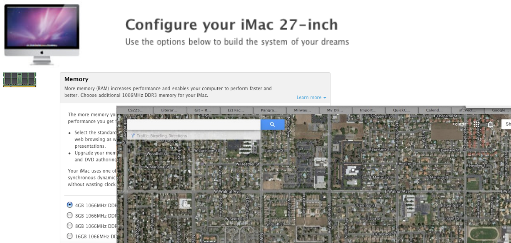

## Today {.smaller}

**Announcements**

- **PA1 is out**, due Monday Oct 5
- **Examlet 1 is this week** — Thursday through Sunday. Book your seat on
  PrairieTest
- HW1 closed Monday

\

**Lesson 3.2 (video)**

- Linked memory
- Singly linked lists
    - `insertAtFront`
    - `printReverse`

## Something NEW!! {.smaller}

Make at least 3 observations about this code:

```cpp
template <class LIT>
struct Node{
   LIT data;
   Node * next;
   Node(LIT nData, Node * next=nullptr): data(nData) {}
};
```

- &nbsp;
- &nbsp;
- &nbsp;
- &nbsp;

::: notes
Four observations, in the order they are worth making:

- It is a `struct`, not a `class` -- so everything is public.
- It is a template, so the node can hold any type.
- **A `Node` contains a pointer to a `Node`.** This is the one that matters,
  and it looks illegal at first: a type defined in terms of itself. It is fine
  because `Node *` is a pointer -- a fixed size, whatever `Node` turns out to
  be. A `Node` containing a `Node` would be infinite; a `Node` containing an
  address is 8 bytes.
- The constructor takes `next` and **never uses it.** The initializer list
  sets `data` only, so `next` is left uninitialised. Worth slowing down on --
  it is a real bug, and it is the kind that bites in PA1.
:::

## A metaphor for memory... {.smaller}



::: notes
Buying memory by the gigabyte, and a street map.

The point of the map: every house has an address, the addresses are laid out in
order, and knowing an address is not the same as knowing what is in the house.
That is the whole idea of a pointer in one picture.
:::

## Variables and Pointers: {.smaller}

:::: {.columns}
::: {.column width="52%"}
Backtrack to variables:

\
\
\

Special variable type:
:::
::: {.column width="48%"}
::: {.memtable}
| loc | name | val | type |
|---|---|---|---|
|  |  |  |  |
|  |  |  |  |
|  |  |  |  |
|  |  |  |  |
|  |  |  |  |
:::
:::
::::

::: notes
Fill the table in as you go.

A variable is four things: a location, a name, a value, and a type. Three of
those are familiar; `loc` is the one nobody has had to think about before, and
it is the whole reason this lesson exists.

Put two or three ordinary variables in the table first -- `int x`, `char c` --
so the columns mean something. Then the special type: a variable whose *value*
is another variable's `loc`. Add it as one more row, so it is visibly the same
kind of thing, not a new species.
:::

## Pointers and dynamic memory: {.smaller}

:::: {.columns}
::: {.column width="34%"}
```cpp
int * p;
```
:::
::: {.column width="66%"}
::: {.memtable}
| loc | name | val | type |
|---|---|---|---|
|  |  |  |  |
|  |  |  |  |
|  |  |  |  |
|  |  |  |  |
|  |  |  |  |
:::
::: {.memtable .heap}
| loc | name | val | type |
|---|---|---|---|
|  |  |  |  |
|  |  |  |  |
|  |  |  |  |
|  |  |  |  |
|  |  |  |  |
:::
:::
::::

::: notes
Two tables now, and the colours are the point: green is the stack, orange is
the heap.

`int * p;` puts one row in the **green** table -- a variable named `p`, of type
`int *`, whose value is garbage. Nothing at all happens in the orange table.
That is the distinction the whole lesson turns on, so say it plainly:
*declaring a pointer does not give you anything to point at.*

Then add `p = new int;` on top and fill the orange row, so both halves are on
the board before the next slide starts asking questions.
:::

## Fun and games with pointers: (warm-up) {.smaller}

```cpp
int * p, q;
```

What type is `q`? \_\_\_\_\_\_\_\_\_\_\_\_\_\_

\

```cpp
int *p;
int x;
p = &x;
*p = 6;
cout << x;
cout << p;
```

`cout << x;` &nbsp; What is output? \_\_\_\_\_\_\_\_\_\_\_\_\_\_

`cout << p;` &nbsp; What is output? \_\_\_\_\_\_\_\_\_\_\_\_\_\_

Write a statement whose output is the value of `x`, using variable `p`:
\_\_\_\_\_\_\_\_\_\_\_\_\_\_

::: notes
First one is the classic: **`q` is an `int`**, not an `int *`. The `*` binds to
the declarator, not the type. That is exactly why the course writes
`int *p, *q;` with the star against the name.

Second block: `x` is 6, because `*p = 6` wrote through `p` into `x`.

`cout << p;` prints an address -- a hex number that changes every run and is
not interesting in itself. Worth saying so, or someone will try to memorise it.

Last blank: `cout << *p;`.
:::

## {.smaller .smallcode}

:::: {.columns}
::: {.column width="42%"}
```cpp
int *p, *q;
p = new int;
q = p;
*q = 8;
cout << *p;
q = new int;
*q = 9;
p = nullptr;
delete q;
q = nullptr;
```
:::
::: {.column width="58%"}
\
\

`cout << *p;` &nbsp; What is output? \_\_\_\_\_\_\_\_\_\_

\
\

`p = nullptr;` &nbsp; Do you like this? \_\_\_\_\_\_\_\_\_\_

`q = nullptr;` &nbsp; Do you like this? \_\_\_\_\_\_\_\_\_\_
:::
::::

::: {.callout-note appearance="minimal"}
Memory leak:

\

Deleting a null pointer:

Dereferencing a null pointer:
:::

::: notes
Trace the whole thing in the two tables, line by line -- this is the slide
that pays for the two-colour setup.

`cout << *p;` prints **8**. `q = p` made them aliases, so `*q = 8` wrote the
very thing `p` points at.

`p = nullptr;` -- **no, this is bad.** `p` was the only handle on that first
`new int`. Setting it to `nullptr` abandons the memory without freeing it. Point
at the orange row that now has nothing aimed at it: that row is stuck there
until the program exits.

`q = nullptr;` -- **yes, this is good.** It comes right after `delete q`, so `q`
is dangling. Setting it to `nullptr` is exactly the right habit.

Same two words, opposite verdicts, and the difference is only what came before.

Then the box, three definitions:

- **Memory leak** -- allocated memory with no remaining pointer to it, so it
  can never be freed.
- **Deleting a null pointer** -- legal, and does nothing at all. Safe.
- **Dereferencing a null pointer** -- undefined behaviour. In practice a
  segfault.

The asymmetry between those last two is the part worth repeating: `delete` on
`nullptr` is harmless, `*` on `nullptr` is fatal.
:::

## Let's explore... {.smaller}

| | | |
|---|---|---|
| **1** | [`pointers1.cpp`](code/lecture-08/pointers1.cpp) | one int, two names |
| **2** | [`pointers2.cpp`](code/lecture-08/pointers2.cpp) | `new`, `delete`, and aliasing |
| **3** | [`pointers3.cpp`](code/lecture-08/pointers3.cpp) | a leak, and two ways to meet `nullptr` |

\

```bash
g++ -o p1 pointers1.cpp && ./p1
```

::: notes
Run them, break them, watch what happens.

1. `p = &x` then `*p = 6`. Print `x`, `*p`, `&x`, `p`, and `&p` -- the last one
   is the surprise, because it makes the point that `p` is a variable like any
   other and has a location of its own. Then assign to `x` and read it back
   through `*p`.

2. `q = p` makes two handles on one heap `int`. Write through `q`, read through
   `p`. Print both pointers -- the addresses are identical, which is the point.

3. The three failures, in order: the leak (overwrite the only pointer to a
   `new`'d int), `delete` on a `nullptr` pointer (legal, does nothing), and
   dereferencing `nullptr`. **The third one really does crash** -- exit 139,
   segmentation fault. Let it.

The 2024 replit links are gone, so these are rebuilt from scratch. Source is
on the site at slides/code/lecture-08/ -- paste into whatever sandbox, or just
run them in a terminal on camera.
:::
