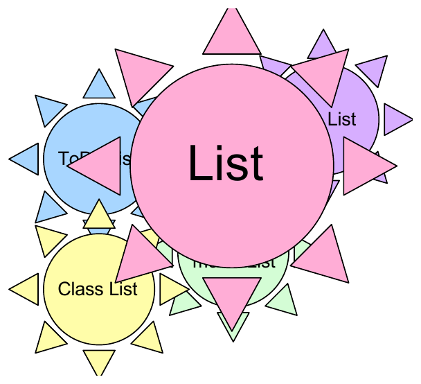

## Today {.smaller}

**Announcements**

- **PA1 is due Monday Oct 5** — this lecture is the preparation for it
- Examlet 2 closes this weekend
- Lab 3 this week

\

**Where we're going**

- The List ADT — what a user sees
- An implementation — what we see
- `insert` at position $k$, with and without a sentinel
- `removeCurrent`, twice

## Abstract Data Type: {.smaller .smallcode}

:::: {.columns}
::: {.column width="32%"}
{width=290}
:::
::: {.column width="68%"}
```cpp
template<class LIT>
class List {
public:
    List();  // ~List(); ??
    int getSize() const;
    void insert(int loc, LIT e);
    void remove(int loc);
    LIT const & getItem(int loc) const;
private:
    // my little secret.
};
```
:::
::::

```cpp
int main() {
    List<int> myList;
    myList.insert(1, 4);
    myList.insert(1, 6);
    myList.insert(2, 0);
    myList.insert(3, myList.getItem(2));
    cout << myList.getSize() << endl;
    myList.remove(2);
    cout << myList.getItem(3) << endl;
}
```

::: notes
A grocery list, a to-do list, a class list, a top-20 list. Different contents,
same operations — that is what makes *List* an abstract data type rather than
a data structure. The ADT is the **interface**; how it is stored is nobody's
business.

Point at `private: // my little secret.` That line is the whole idea.

Then trace `main()` on the board. Positions are 1-based here, which is worth
saying out loud before anyone assumes otherwise. Work it slowly:

- `insert(1,4)` → `4`
- `insert(1,6)` → `6 4`
- `insert(2,0)` → `6 0 4`
- `getItem(2)` is `0`, so `insert(3,0)` → `6 0 0 4`
- `getSize()` prints **4**
- `remove(2)` → `6 0 4`
- `getItem(3)` prints **4**

Nothing in that trace mentions a pointer. That is the point: the user of the
ADT cannot tell whether it is a list or an array underneath.
:::

## ADT List, an implementation: {.smaller .smallcode}

:::: {.columns}
::: {.column width="52%"}
```cpp
template<class LIT>
class List {
public:
    List() : size(0), head(nullptr);
    ~List();  // + op= and cctor
    int getSize() const;
    void insert(int loc, LIT e);
    void remove(int loc);
    LIT const & getItem(int loc) const;
private:
    struct Node {
        LIT data;
        Node * next;
        Node(LIT newData) : data(newData), next(nullptr) { }
    };
    Node * head;
    int size;
};
```
:::
::: {.column width="48%"}
```cpp
template<class LIT>
Node * List<LIT>::Find(Node * place, int k) {
    if ((k == 0) || (place == nullptr))
        return place;

}
```

\

`Find` is private. Why?
:::
::::

::: notes
Now the secret is out: a `head` pointer, a `size`, and a private nested
`Node`. `Node` is nested **inside** `List` because no one outside has any
business knowing it exists.

`Find(place, k)` walks $k$ steps from `place` and returns what it lands on.
The missing line is `return Find(place->next, k-1);`.

Two things to draw out:

- **Why is `Find` private?** It returns a `Node *`. Handing that to a user
  would leak the implementation and let them corrupt the list. Everything
  public speaks in positions, not pointers.
- **`~List()`, `op=`, copy constructor.** The comment on line 5 is a promise
  the class has to keep, because it owns heap memory. This is exactly PA1's
  `Chain`, and it is why PA1 asks for all three.

`Find` is $\Theta(k)$. That number is about to dominate everything.
:::

## Insert new node in $k$th position: {.smaller .smallcode}

<svg class="nodefig" width="420" height="80">
  <text class="lbl" x="4" y="46" font-size="15">head</text>
  <path class="wire" d="M46 41 L 86 41"/>
  <polygon points="96,41 84,35 84,47" fill="#1a1a1a"/>
  <rect class="cell" x="98" y="18" width="46" height="46"/>
  <rect class="cell" x="144" y="18" width="26" height="46"/>
  <text class="val" x="121" y="48" font-size="20" text-anchor="middle">3</text>
  <circle cx="157" cy="41" r="4" fill="#1a1a1a"/>
  <path class="wire" d="M157 41 L 200 41"/>
  <polygon points="210,41 198,35 198,47" fill="#1a1a1a"/>
  <rect class="cell" x="212" y="18" width="46" height="46"/>
  <rect class="cell" x="258" y="18" width="26" height="46"/>
  <text class="val" x="235" y="48" font-size="20" text-anchor="middle">6</text>
  <circle cx="271" cy="41" r="4" fill="#1a1a1a"/>
  <path class="wire" d="M271 41 L 314 41"/>
  <polygon points="324,41 312,35 312,47" fill="#1a1a1a"/>
  <rect class="cell" x="326" y="18" width="46" height="46"/>
  <rect class="cell" x="372" y="18" width="26" height="46"/>
  <text class="val" x="349" y="48" font-size="20" text-anchor="middle">4</text>
  <line class="nullx" x1="376" y1="60" x2="394" y2="22"/>
</svg>

```cpp
void List<LIT>::insert(int loc, LIT e) {


}
```

Analysis: &nbsp;&nbsp;&nbsp;&nbsp;&nbsp;&nbsp; *aside: insert new $k$th in an array:*

::: notes
Let them write it, and let them hit the wall.

The body needs `Find(head, loc-1)` to get the node *before* the insertion
point, then rewire. But **`loc == 1` is a special case**: there is no node
before position 1, so you have to update `head` instead. Two branches for what
feels like one operation.

Analysis: `Find` is $\Theta(k)$, the rewiring is $\Theta(1)$, so insert is
$\Theta(k)$ — worst case $\Theta(n)$.

The aside is worth the thirty seconds: inserting at position $k$ in an *array*
is $\Theta(n-k)$, because everything after has to shift. The list wins when
you are near the front, the array wins when you are near the back, and both
are $\Theta(n)$ in the worst case. Lists are not simply "faster".
:::

## Insert $k$th with a sentinel: {.smaller .smallcode}

<svg class="nodefig" width="500" height="80">
  <text class="lbl" x="4" y="46" font-size="15">head</text>
  <path class="wire" d="M46 41 L 76 41"/>
  <polygon points="86,41 74,35 74,47" fill="#1a1a1a"/>
  <rect class="cell" x="88" y="18" width="46" height="46"/>
  <rect class="cell" x="134" y="18" width="26" height="46"/>
  <line class="nullx" x1="92" y1="60" x2="130" y2="22"/>
  <circle cx="147" cy="41" r="4" fill="#1a1a1a"/>
  <path class="wire" d="M147 41 L 180 41"/>
  <polygon points="190,41 178,35 178,47" fill="#1a1a1a"/>
  <rect class="cell" x="192" y="18" width="46" height="46"/>
  <rect class="cell" x="238" y="18" width="26" height="46"/>
  <text class="val" x="215" y="48" font-size="20" text-anchor="middle">3</text>
  <circle cx="251" cy="41" r="4" fill="#1a1a1a"/>
  <path class="wire" d="M251 41 L 284 41"/>
  <polygon points="294,41 282,35 282,47" fill="#1a1a1a"/>
  <rect class="cell" x="296" y="18" width="46" height="46"/>
  <rect class="cell" x="342" y="18" width="26" height="46"/>
  <text class="val" x="319" y="48" font-size="20" text-anchor="middle">6</text>
  <circle cx="355" cy="41" r="4" fill="#1a1a1a"/>
  <path class="wire" d="M355 41 L 388 41"/>
  <polygon points="398,41 386,35 386,47" fill="#1a1a1a"/>
  <rect class="cell" x="400" y="18" width="46" height="46"/>
  <rect class="cell" x="446" y="18" width="26" height="46"/>
  <text class="val" x="423" y="48" font-size="20" text-anchor="middle">4</text>
  <line class="nullx" x1="450" y1="60" x2="468" y2="22"/>
</svg>

```cpp
void List<LIT>::insert(int loc, LIT e) {
    Node * curr = Find(head, loc-1);
    Node * newN = new Node(e);
    newN->next = curr->next;
    curr->next = newN;
}
```

Wow, this is convenient! How do we make it happen?

```cpp
template<class LIT>
List<LIT>::List() {


}
```

::: notes
The first cell holds nothing — it is a **sentinel**, a real node with no data.
Compare the two versions side by side: the special case for `loc == 1` is
simply gone, because position 1 now *does* have a node before it.

Four lines, no branches, and nothing to get wrong. That is what the extra node
buys, and it costs one node of memory forever.

The constructor has to build it: `head = new Node();` and `size = 0;`. Which
means `Node` needs a default constructor — the one on the previous slide takes
a value, so it will not do. Let them find that.

**This is PA1's `Chain` exactly.** It has head *and* tail sentinels, which is
why `insertBack` is as easy as `insertFront`. Worth saying explicitly, since
they are writing it this week.
:::

## Remove node in a fixed position: {.smaller .smallcode}

Given a pointer to the node you wish to remove.

<svg class="nodefig" width="500" height="106">
  <text class="lbl" x="4" y="46" font-size="15">head</text>
  <path class="wire" d="M46 41 L 76 41"/>
  <polygon points="86,41 74,35 74,47" fill="#1a1a1a"/>
  <rect class="cell" x="88" y="18" width="46" height="46"/>
  <rect class="cell" x="134" y="18" width="26" height="46"/>
  <text class="val" x="111" y="48" font-size="20" text-anchor="middle">4</text>
  <circle cx="147" cy="41" r="4" fill="#1a1a1a"/>
  <path class="wire" d="M147 41 L 180 41"/>
  <polygon points="190,41 178,35 178,47" fill="#1a1a1a"/>
  <rect class="cell" x="192" y="18" width="46" height="46"/>
  <rect class="cell" x="238" y="18" width="26" height="46"/>
  <text class="val" x="215" y="48" font-size="20" text-anchor="middle">2</text>
  <circle cx="251" cy="41" r="4" fill="#1a1a1a"/>
  <path class="wire" d="M251 41 L 284 41"/>
  <polygon points="294,41 282,35 282,47" fill="#1a1a1a"/>
  <rect class="cell" x="296" y="18" width="46" height="46"/>
  <rect class="cell" x="342" y="18" width="26" height="46"/>
  <text class="val" x="319" y="48" font-size="20" text-anchor="middle">7</text>
  <circle cx="355" cy="41" r="4" fill="#1a1a1a"/>
  <path class="wire" d="M355 41 L 388 41"/>
  <polygon points="398,41 386,35 386,47" fill="#1a1a1a"/>
  <rect class="cell" x="400" y="18" width="46" height="46"/>
  <rect class="cell" x="446" y="18" width="26" height="46"/>
  <text class="val" x="423" y="48" font-size="20" text-anchor="middle">8</text>
  <line class="nullx" x1="450" y1="60" x2="468" y2="22"/>
  <path class="wire" d="M215 96 L 215 74"/>
  <polygon points="215,64 209,76 221,76" fill="#1a1a1a"/>
  <text class="lbl" x="215" y="104" font-size="15" text-anchor="middle">curr</text>
</svg>

**Solution #1:**

```cpp
void removeCurrent(Node * head, Node * curr) {


}
```

Analysis:

::: notes
The obvious solution: walk from `head` to find the node *before* `curr`,
rewire around `curr`, then `delete curr`.

```
Node * p = head;
while (p->next != curr) p = p->next;
p->next = curr->next;
delete curr;
```

$\Theta(n)$ — and that should feel wrong. We were *handed* the node. The work
is entirely in finding its predecessor, which a singly linked list cannot do.

Ask what would fix it. Two answers, and both are coming: a second pointer in
each node (doubly linked — PA1), or the trick on the next slide.
:::

## Remove node in a fixed position: {.smaller .smallcode}

**Constant time hack:**

<svg class="nodefig" width="500" height="106">
  <text class="lbl" x="4" y="46" font-size="15">head</text>
  <path class="wire" d="M46 41 L 76 41"/>
  <polygon points="86,41 74,35 74,47" fill="#1a1a1a"/>
  <rect class="cell" x="88" y="18" width="46" height="46"/>
  <rect class="cell" x="134" y="18" width="26" height="46"/>
  <text class="val" x="111" y="48" font-size="20" text-anchor="middle">4</text>
  <circle cx="147" cy="41" r="4" fill="#1a1a1a"/>
  <path class="wire" d="M147 41 L 180 41"/>
  <polygon points="190,41 178,35 178,47" fill="#1a1a1a"/>
  <rect class="cell" x="192" y="18" width="46" height="46"/>
  <rect class="cell" x="238" y="18" width="26" height="46"/>
  <text class="val" x="215" y="48" font-size="20" text-anchor="middle">2</text>
  <circle cx="251" cy="41" r="4" fill="#1a1a1a"/>
  <path class="wire" d="M251 41 L 284 41"/>
  <polygon points="294,41 282,35 282,47" fill="#1a1a1a"/>
  <rect class="cell" x="296" y="18" width="46" height="46"/>
  <rect class="cell" x="342" y="18" width="26" height="46"/>
  <text class="val" x="319" y="48" font-size="20" text-anchor="middle">7</text>
  <circle cx="355" cy="41" r="4" fill="#1a1a1a"/>
  <path class="wire" d="M355 41 L 388 41"/>
  <polygon points="398,41 386,35 386,47" fill="#1a1a1a"/>
  <rect class="cell" x="400" y="18" width="46" height="46"/>
  <rect class="cell" x="446" y="18" width="26" height="46"/>
  <text class="val" x="423" y="48" font-size="20" text-anchor="middle">8</text>
  <line class="nullx" x1="450" y1="60" x2="468" y2="22"/>
  <path class="wire" d="M215 96 L 215 74"/>
  <polygon points="215,64 209,76 221,76" fill="#1a1a1a"/>
  <text class="lbl" x="215" y="104" font-size="15" text-anchor="middle">curr</text>
</svg>

```cpp
void removeCurrent(Node * head, Node * curr) {


}
```

::: notes
You cannot reach the node before `curr` — so **do not remove `curr` at all.**
Copy its successor's data into it, then remove the *successor*, which you can
reach because `curr->next->next` is one hop away.

```
Node * victim = curr->next;
curr->data = victim->data;
curr->next = victim->next;
delete victim;
```

$\Theta(1)$. The node holding 2 survives; it just stops holding 2.

Then break it, because it does not always work:

- **`curr` is the last node.** There is no successor to steal from, and this
  falls back to $\Theta(n)$ or fails outright.
- **Anyone else holding a pointer to `curr->next`** now has a pointer to freed
  memory. We changed which node holds which value behind their back.

That second one is the real lesson, and it lands right before PA1: a trick
that is correct in isolation can be wrong once someone else holds a pointer
into your structure.
:::
