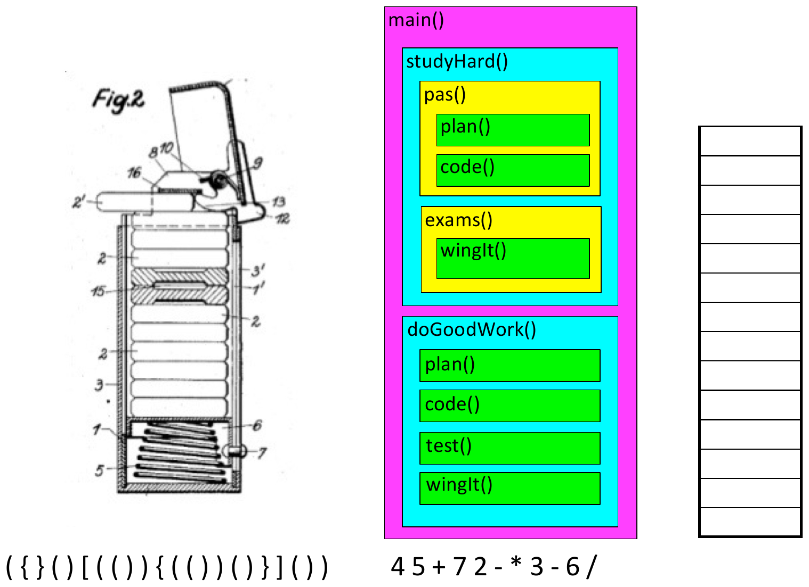

## Today {.smaller}

**Announcements**

- **PA1 is due tonight**, 11:59 pm
- Examlet 3 runs **Thursday to Sunday** — book your seat on PrairieTest
- PEX3 is posted

\

**Where we're going**

- Stacks
- The Stack ADT
- Two implementations
- The Witch's Potion Pantry

## Stacks {.smaller}

{width=78%}

::: notes
The spring-loaded plate dispenser (a real patent drawing): you only ever
touch the top plate. That is the whole ADT.

Then the call stack. Walk `main` → `studyHard` → `pas` → `plan`, and fill in
the empty column as calls go on and come off. Every program they have ever
run has used a stack.

Two classic uses along the bottom, worth naming and leaving for later:
balanced brackets, and evaluating postfix (`4 5 + 7 2 - * 3 - 6 /`).
:::

## Abstract Data Type: {.smaller .smallcode}

:::: {.columns}
::: {.column width="62%"}
**Stack ADT:**

```cpp
template<class LIT>
class Stack {
public:
    Stack();  // ~Stack, cctor, op=?
    bool empty() const;
    void push(const LIT & e);
    LIT pop();
private:

    //  ?

};
```
:::
::: {.column width="38%"}
```
push(3)
push(8)
push(4)
pop()
pop()
push(6)
pop()
push(2)
pop()
pop()
```
:::
::::

Push 1, 2, 3 in order, with interleaved pops. What output is impossible?

::: notes
Trace the sequence on the right: the pops return **4, 8, 6, 2, 3**.

The question at the bottom: pushing 1, 2, 3 in order, **3 1 2** is the only
impossible output. Once 3 has come off, 2 is on top of 1, so 1 cannot come
out before 2.

The `private:` section is a question mark on purpose. The next two slides
are two different answers to it.
:::

## Stack linked memory implementation: {.smaller .smallcode}

:::: {.columns}
::: {.column width="50%"}
```cpp
template<class LIT>
class Stack {
public:
    Stack();  // ~Stack, cctor, op=?
    bool empty() const;
    void push(const LIT & e);
    LIT pop();
private:
    struct Node {
        LIT data;
        Node * next;
    };
    Node * top;
    int size;
};
```
:::
::: {.column width="50%"}
<svg class="nodefig" width="300" height="80">
  <text class="lbl" x="4" y="46" font-size="15">top</text>
  <path class="wire" d="M34 41 L 60 41"/>
  <polygon points="70,41 58,35 58,47" fill="#1a1a1a"/>
  <rect class="cell" x="72" y="18" width="40" height="46"/>
  <rect class="cell" x="112" y="18" width="22" height="46"/>
  <text class="val" x="92" y="48" font-size="20" text-anchor="middle">3</text>
  <circle cx="123" cy="41" r="4" fill="#1a1a1a"/>
  <path class="wire" d="M123 41 L 146 41"/>
  <polygon points="156,41 144,35 144,47" fill="#1a1a1a"/>
  <rect class="cell" x="158" y="18" width="40" height="46"/>
  <rect class="cell" x="198" y="18" width="22" height="46"/>
  <text class="val" x="178" y="48" font-size="20" text-anchor="middle">6</text>
  <circle cx="209" cy="41" r="4" fill="#1a1a1a"/>
  <path class="wire" d="M209 41 L 232 41"/>
  <polygon points="242,41 230,35 230,47" fill="#1a1a1a"/>
  <rect class="cell" x="244" y="18" width="40" height="46"/>
  <rect class="cell" x="284" y="18" width="14" height="46"/>
  <text class="val" x="264" y="48" font-size="20" text-anchor="middle">4</text>
  <line class="nullx" x1="286" y1="60" x2="296" y2="22"/>
</svg>

```cpp
template<class LIT>
LIT Stack<LIT>::pop() {


}
```

```cpp
template<class LIT>
void Stack<LIT>::push(LIT d) {
    Node * newN = new Node(d);
    newN->next = top;
    top = newN;
    size++;
}
```
:::
::::

::: notes
The top of the stack is the **front** of the list. `push` is
`insertAtFront` from lecture 9, almost word for word.

`pop`, filled in:

```
LIT retval = top->data;
Node * old = top;
top = top->next;
delete old;
size--;
return retval;
```

Save the value **before** deleting the node. Both operations are
$\Theta(1)$: nothing is ever traversed.
:::

## Stack array based implementation: {.smaller .smallcode}

:::: {.columns}
::: {.column width="60%"}
```cpp
template<class LIT>
class Stack {
public:
    Stack();  // ~Stack, cctor, op=?
    bool empty() const;
    void push(const LIT & e);
    LIT pop();
private:
    vector<LIT> items;
};
```
:::
::: {.column width="40%"}
<svg class="nodefig" width="300" height="200">
  <line x1="40" y1="14" x2="92" y2="14" stroke="#1a1a1a" stroke-width="3"/>
  <rect x="40" y="18" width="52" height="40" fill="#fffba8" stroke="#1a1a1a" stroke-width="2"/>
  <rect x="40" y="58" width="52" height="40" fill="#fffba8" stroke="#1a1a1a" stroke-width="2"/>
  <rect x="40" y="98" width="52" height="40" fill="#fffba8" stroke="#1a1a1a" stroke-width="2"/>
  <rect x="40" y="138" width="52" height="40" fill="#fffba8" stroke="#1a1a1a" stroke-width="2"/>
  <text class="val" x="66" y="45" font-size="20" text-anchor="middle">3</text>
  <text class="val" x="66" y="85" font-size="20" text-anchor="middle">6</text>
  <text class="val" x="66" y="125" font-size="20" text-anchor="middle">8</text>
  <path class="wire" d="M140 118 L 102 118"/>
  <polygon points="94,118 106,112 106,124" fill="#1a1a1a"/>
  <text class="lbl" x="146" y="116" font-size="14">_______ of stack</text>
  <text class="val" x="146" y="140" font-size="14">items[_______]</text>
</svg>
:::
::::

:::: {.columns}
::: {.column width="50%"}
```cpp
template<class LIT>
LIT Stack<LIT>::pop() {
    LIT retval = items[_____];
    items.pop_back();
    return retval;
}
```
:::
::: {.column width="50%"}
```cpp
template<class LIT>
void Stack<LIT>::push(LIT d) {

    items.push_back(d);

}
```
:::
::::

::: notes
The top of the stack is the **back** of the vector. The blanks are
**top** and **items.size()-1**.

`pop` is $\Theta(1)$. `push` is $\Theta(1)$ as long as there is room. When
the array fills, the vector resizes, which is Nathan's video from Friday:
double the capacity and `push` is still $\Theta(1)$ on average.

The two implementations have the same interface and very different insides.
That is the ADT point from the last slide, made concrete.
:::

## Get ready {.activity}

**Open PrairieLearn now:** Class Activities → *The Witch's Potion Pantry*

Click **Open workspace** — it takes a minute to start, so let it load while
you watch the story.

::: notes
Doing this before the story matters. A whole section launching workspaces in
the same minute is the slowest part of the activity, and the first launch
has to pull the C++ image.
:::

## {background-iframe="viz/potion_pantry_story.html?v=2" background-interactive="true"}

::: notes
Click into the story to give it focus, then → or Enter to advance.
`?step=N` in the iframe URL jumps to scene N if you need to resume.

The two halves are the two parts of the puzzle: the ghost carries **one jar
at a time** (Part 1), the witch lifts **the whole group at once** (Part 2).
Point at shelf 3 at the end of each half — K R **B W** versus K R **W B**.
Same moves, the pair swaps order.
:::

## Your Turn {.activity}

Every one of you has your own pantry and your own recipe!

- In `potions.cpp`, write `part1` and `part2` — using `std::stack`.

- `make example` should print **CMZ** and **MCD**. 

- `make input` reveals your words! 


::: notes
`std::stack` splits our `pop` in two: `top()` reads the top item, and
`pop()` removes it and returns nothing. Worth saying before they start, or
the first ten minutes are compile errors.

Part 1 is a direct translation. Part 2 is the point: a stack will not lift
a block and set it down in order. The move is a second, temporary stack —
pop the group into it, which reverses it, then pop it onto the destination,
which reverses it back. Let them find it.

Full credit 2:00–3:59 today (both sections); open afterwards for practice at
zero credit.
:::

## Today, you built a data structure {.smaller}

| | |
|:-----|:-------------------------|
| **Defined** | the Stack ADT: `push`, `pop`, `empty`. Last in, first out |
| **Implemented** | two ways: linked list and vector |
| **Analyzed** | `push` and `pop` are $\Theta(1)$ for linked list. For the vector, doubling on resize keeps the functions $\Theta(1)$ on average. |
| **Applied** | Potion Pantry: use a stack to reverse the pile! |

::: notes
Point at the four verbs. That is the life cycle of every structure for the
rest of the term: define the ADT, implement it, analyze it, use it.

The Part 2 trick is worth one more sentence: popping a group into a
temporary stack reverses it; popping it onto the destination reverses it
back. Two reversals, original order.
:::
